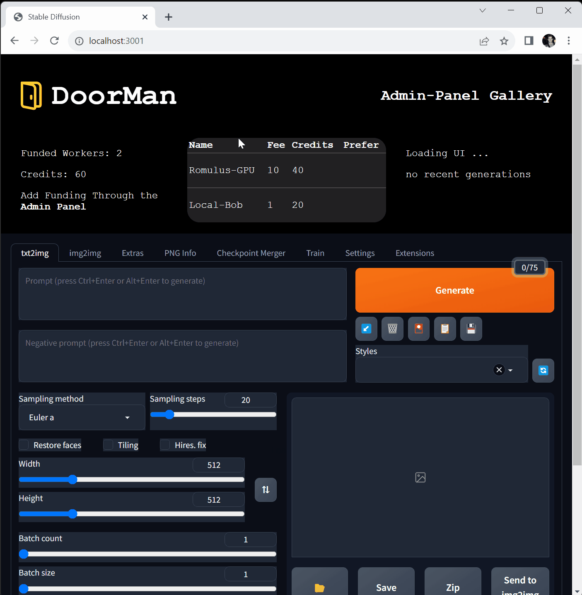

# DoorMan

Your on-ramp to the LightningCloud from your favorite GenerativeAI GUI.

### Quickstart - DoorMan on Local & Replit

```bash
git clone https://github.com/sutt/DoorMan.git
cd DoorMan

npm install

# on replit see .env.example for adding env var,
# not needed for running locally as app is designed to.
# export DOORMAN_SERVER_HOST=0.0.0.0 or
# create a .env at root of this repo and populate it

# now typescript stuff: make sure you have tsc installed
# which can be done with npm install -g typescript
# you'll need a tsconfig.json file in the root of the project
# which I've added here for ease of use. It will build to ./dist
# this should run and exit silently:
tsc

# now seed the Funding table
# You should see `Doorman `Funding` table seeded!` in the console.
# You'll only need to do this once per install, as it will create 
# the table in a sqlite database. However you can do it multiple
# times to get more credits to play with, just note your previous
# credits will be lost.
node ./dist/data/seed-doorman.js

# this will start DoorMan ui on localhost:3001 
# it will use ts-node / nodemon
# on windows run:
npm [run] start
# on unix run or replit run:
#(this is b/c escaping quotes and such in the start script)
npm [run] unixstart

# Success?! Yuo should see:
# > doorman-v1@1.0.0 start
# > Doorman File Server & Frontend-API is listening on localhost:3001

```

For a more thorough walk through check out this [video demo](https://youtu.be/wEzd7Ow9qsE?t=660) of setup & run.

#### Further Commands

```bash
# to start BossMan :
# set env BOSSMAN=1, or run with --bossman flag
# see .env.example for setting up the env vars like:
# INVOICE_KEY, SD_API_BASEURL, BOSSMAN_SERVER_PORT

tsc
node ./dist/index.js --bossman

# Success?! Yuo should see:
# > BossMan server running on 127.0.0.1:8090

# to run Automatic1111 webui 
# you only need this if you're setting up a BossMan to run and earn sats, not to make images with DoorMan.
# note: no need to run it it publically, as it will be proxied by DoorMan
webui.bat --no-gradio-app [--port 7861]
```

Coming soon: npm package...install as simple as `npm install -g doorman`.

### Preview




### Lightning cleaves Front & Back of AI apps

How lightning enables cooperative inter-operation of Front & Back ends of an AI app run by different users:

On the left, we see the typical webapp architecutre with the backend hosted on a personal cloud or beefy desktop PC for hardware boosted inference, while the user controls the engine through a GUI on their local machine in the browser. 

Most users want to use open-source AI, not administer it. Unfortunately, the open-source AI community has not yet developed a robust, easy-to-use, and secure way to host and share AI models.


On the right, we see how each of the components of the architecture is preserved in totality, but now handled by separate parties:
 - Prompt Requestors
 - Cloud Workers - available vm's or gaming computer can pair up with the user's GUI to provide image generation or text completion in exchange for a one-time lightning payment.

If this is confusing, think of Uber. The user is the passenger, the driver is the worker. What ties them together is self-interest, and that's what DoorMan focuses on: 

 > How to attach a lightning payment such that quick one and done transactions can occur between two parties unfamiliar in the most trustless way.


### Components & Information  Flow

